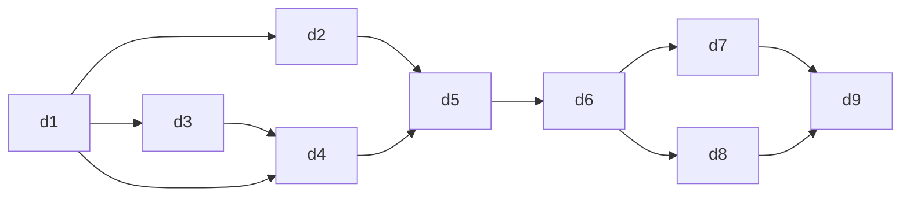

# TPM Review — Epic D: Visualizer + Library

**Reviewer:** tpm
**Date:** 2026-05-01
**Scope:** d1–d9, read-only

---

VERDICT: approve-with-escalation

---

## A. Coverage

All US-D-N and FR-D-N are covered. Verified against \_INDEX.md coverage table and cross-checked with individual YAMLs.

| Requirement | Covering YAMLs | Status  |
| ----------- | -------------- | ------- |
| US-D-1      | d4, d5         | covered |
| US-D-2      | d2, d5         | covered |
| US-D-3      | d7, d9 (+d6)   | covered |
| US-D-4      | d6, d8 (+d9)   | covered |
| FR-D-1      | d3, d4, d5     | covered |
| FR-D-2      | d1, d2, d5     | covered |
| FR-D-3      | d2, d5, d6     | covered |
| FR-D-4      | d7, d9         | covered |
| FR-D-5      | d8             | covered |
| FR-D-6      | d8             | covered |
| FR-D-7      | d7, d9         | covered |
| FR-D-8      | d6 (+d5)       | covered |

**No gaps.**

**One naming drift to note:** The \_INDEX.md story table lists d3 as "6 nail-tip mask SVG assets" — the actual YAML file is `d3-nail-tip-mask-svg-assets.yaml`, consistent. d4 is "NailVisualizer + VisualizerFrame composition" — YAML file is `d4-nailvisualizer-composition.yaml`, consistent. No traceability breaks.

---

## B. Sequencing — Dependency Graph



**Slice boundary respected:** d1–d5 are Slice 5; d6–d9 are Slice 6. d6 (the gate) correctly depends on d5 (slice 5 complete). No cross-slice depends_on violations.

**Verified against YAML `depends_on` fields:**

- d1: `[]` — correct
- d2: `[d1-nailshape-union-migration]` — correct
- d3: `[d1-nailshape-union-migration]` — correct
- d4: `[d1-nailshape-union-migration]` — listed; note d3 not listed but d4's ui-design step gates on wireframe approval and d4 implement step explicitly imports SVGs from d3. This is a soft ordering handled within steps, not a hard `depends_on`. Acceptable but worth noting — if d3 ships late, d4 implement will block.
- d5: `[d2-shape-state-and-patch-route, d4-nailvisualizer-composition]` — correct
- d6: `[d5-design-page-visualizer-integration]` — correct
- d7: `[d6-design-detail-loader-and-reopen]` — correct
- d8: `[d6-design-detail-loader-and-reopen]` — correct
- d9: `[d7-design-rename, d8-regenerate-from-stored-inputs]` — correct

**Minor sequencing note:** d4's `depends_on` does not formally list d3. The implement step will fail if d3 SVGs don't exist. Recommend adding `d3-nail-tip-mask-svg-assets` to d4's `depends_on`. Not a blocker — d3 is short (low complexity) and will complete before d4 implement step in practice.

---

## C. Parallelism

| After...           | Can run in parallel                                     |
| ------------------ | ------------------------------------------------------- |
| d1 lands           | d2, d3 (both depend only on d1)                         |
| d3 unit-tests pass | d4 can start (assets locked; d4 implement imports them) |
| d5 lands           | d6 (no parallelism here — d6 is the gate)               |
| d6 lands           | d7, d8 in parallel                                      |
| d7 + d8 land       | d9                                                      |

**Over-sequencing call:** None. The d2/d3 parallel window is called out correctly. The d7/d8 parallel window is well-identified.

**Rules-lane parallelism hazard:** d2, d6, d7, d8, d9 all add rules-lane integration tests that hit the Firestore emulator. Per `feedback_storage_emulator_parallel_race.md`, concurrent rules-lane files cause flaky failures. When d7 and d8 run in parallel (as recommended above), their rules-lane test files will race unless `vitest.config.rules.ts` already has `fileParallelism: false`. The \_INDEX.md cross-cutting section does not explicitly call this out for Slice 6 stories. **Recommend adding a note to d7 and d8 that their rules-lane tests must run under `fileParallelism: false` (same config as established in Epic B/C).** Not a blocker; the fix is already known.

---

## D. Silent-Break Risk Mitigation

### Risk 1 — "Visualizer looks cheap" (Slice 5)

**Status: covered in d4.**

d4 `risks:` block entry:

- `severity: high` — "2D visualizer technically renders but feels cheap (silent-break per outline Risk #5)"
- `mitigation:` snapshot baseline per shape + reviewer visual sanity check + designer wireframe alignment + tablet QA in d5 e2e

d5 reinforces via Playwright snapshot baselines (e2e spec) and shape-switch integration tests.

d3's `acceptance_criteria` includes: "no clipping artifact extends past the viewBox" — covers rendering correctness at the asset layer.

**Assessment:** Silent-break risk has explicit named entry at the right layer (d4 composition), with verification pushed to both d4 (unit snapshots) and d5 (e2e). Adequate.

**One gap to note:** d5's own `risks:` section — not visible in indexed content. The \_INDEX.md notes d5 as high-complexity with Playwright snapshots. The research brief calls out that `playwright.config.ts` has no existing `snapshotDir` or `toHaveScreenshot` config — this is a first-time setup, not just test authoring. d5's AC and implement step should explicitly call out baseline generation (`--update-snapshots`) as a required CI setup step. This is Research Brief Open Question #4 — **still unresolved in the YAMLs.** Recommend d5's implement step include the Playwright snapshot config setup explicitly in its description.

### Risk 2 — "Regenerate uses wrong inputs" (Slice 6)

**Status: well-covered in d8.**

d8 `risks:` block:

- `severity: high` — "Stored-input invariant silently broken — regenerate uses any current UI state field"
- `mitigation:` integration test explicitly differs UI state from stored state and asserts provider sees stored only

d8 AC #1 explicitly states "a new generation runs using ONLY stored inputs." The code example (Stored-inputs invariant test) seeds a design with `prompt='red glitter'` and UI state with `prompt='something else'`, asserting the provider receives only the stored value.

d6 (the prerequisite loader) surfaces `staleReferenceCount` — d8 implements a controlled failure path when `staleReferenceCount > 0`, preventing silent degraded-input regeneration.

**Assessment:** Best-covered risk in the epic. Explicit test scaffold, explicit failure path, explicit design decision (no request body fields from UI). No gaps.

---

## E. Wireframe Gate

Expected UI YAMLs per \_INDEX.md: d3, d4, d5, d7, d8, d9.

Verification against YAML `steps:` — all have a `ui-design` step that reads the wireframe manifest and checks `wireframe_approval.status == approved`:

| YAML | ui-design step | wireframe file referenced                      |
| ---- | -------------- | ---------------------------------------------- |
| d3   | yes            | `manifest.yaml` + `visualizer-view.html`       |
| d4   | yes            | `visualizer-view.html` + `manifest.yaml`       |
| d5   | yes (indexed)  | expected: visualizer-view.html                 |
| d7   | yes            | `reopened-design.html` (inferred from context) |
| d8   | yes            | `reopened-design.html`                         |
| d9   | yes (indexed)  | expected: library-view.html                    |

Non-UI YAMLs (d1, d2, d6) have no `ui-design` step — correct.

**Assessment:** Wireframe gate is consistently applied to all 6 UI stories. Confirmed.

---

## F. Cross-Cutting Concerns

Verified against individual YAML `cross_cutting:` blocks:

| Concern            | Applied to                                      | Verified                                              |
| ------------------ | ----------------------------------------------- | ----------------------------------------------------- |
| types-coverage     | d1 (NailShape union), d4 (theme exhaustiveness) | confirmed in YAML                                     |
| security-rules     | d2, d6, d7, d8, d9                              | confirmed; rules-lane tests present in each           |
| jsdom-vs-node      | all route handler tests                         | @vitest-environment node called out in d2, d6, d7, d8 |
| error-logging      | all network/third-party catch blocks            | confirmed in d2, d4, d6, d7, d8                       |
| provider-isolation | d8                                              | MSW mock of Gemini specified                          |
| regression         | d5                                              | Playwright snapshot baselines                         |

**One gap:** d5 does not appear in `security-rules` cross-cutting list — d5 is a UI integration story with no new route, so this is correct (security-rules is owned by d2 which d5 consumes). Confirmed intentional.

**d3 cross-cutting:** d3 is a pure SVG asset story. No `cross_cutting:` concerns needed. Correct omission.

---

## G. Agent-Readiness Scores

Scoring: description(2) + testable AC(2) + files list(1) + code snippets(1) + references(1) + specific risks(1) + steps concrete(1) = 9 max. Flag below 7.

| YAML | Score | Notes                                                                                                                                                                                                            |
| ---- | ----- | ---------------------------------------------------------------------------------------------------------------------------------------------------------------------------------------------------------------- |
| d1   | 9/9   | Concrete union migration, code examples showing before/after, assertUnreachable helper, risk for magic-number consumers                                                                                          |
| d2   | 9/9   | Route I/O contract, rule diff-key snippet, rules-lane test spec, concurrency risk                                                                                                                                |
| d3   | 8/9   | Pure asset story; AC testable (fs assertions); minor: no code snippet for SVG path commands (acceptable for hand-tuned assets)                                                                                   |
| d4   | 9/9   | High-complexity; snapshot tests, theme prop contract, cheap-render risk explicit, Tailwind v4 quirk noted                                                                                                        |
| d5   | 7/9   | High-complexity; Playwright snapshot setup (Open Q#4) unresolved — implement step should include `playwright.config.ts` snapshot config; otherwise concrete                                                      |
| d6   | 9/9   | DesignDetail type snippet, staleReferenceCount surfaced, 404-not-403 design decision, N+1 risk                                                                                                                   |
| d7   | 8/9   | Save route I/O, 80-char limit decision, field-scoped rules; minor: no explicit AC covering the "name later" empty→named flow end-to-end                                                                          |
| d8   | 9/9   | Best-authored story; stored-inputs invariant test scaffold, concurrency mitigation, lineage preservation verified in e2e                                                                                         |
| d9   | 7/9   | Library grid story; **thumbnail URL strategy (Research Brief Open Q#2) still unresolved** — d9 implement will hit "no client download URL helper" wall unless resolved in research step or a prior story adds it |

**Below-threshold flags:**

- **d5 (7/9):** Playwright snapshot config setup is a first-time CI step not addressed in the implement description. Recommend adding `playwright.config.ts` snapshot config to d5's implement step explicitly.
- **d9 (7/9):** Library thumbnail URL derivation is unresolved (Research Brief Open Question #2). The research step must resolve this before test-spec. If the answer requires a new server helper, d9's files list and d6 (or a sub-story) need updating. Flag to orchestrator.

---

## H. Escalation Flags

```
ESCALATION_FLAGS:
  - trigger: security:plan-audit
    placement: pre-exec
    severity: major
    stories: [d2, d6, d7, d8, d9]
    reason: "Five YAMLs modify firestore.rules across Slice 5 and Slice 6. Changes include: field-scoped shape PATCH (d2), owner-read for designs+references (d6), name/updatedAt field write (d7), regenerate ownership + latestGenerationId mutation guard (d8), library list query scope (d9). Cumulative rules surface with non-trivial interdependencies. A pre-exec security plan-audit should validate the intended rules composition before any of these stories execute."
    raised_by: tpm
```

**Accessibility note (minor, not escalated):** d3 (ShapeSelector pill buttons) already uses `aria-pressed` per the research brief. d4 has no explicit a11y cross-cutting concern for the visualizer (5-nail hand layout). The visualizer is decorative-first (not interactive), so a screen-reader treatment of `aria-hidden` or `role=img` with an alt description would be sufficient. This is below escalation threshold given Don's locked flat-aesthetic decision, but the reviewer step in d4 should confirm the aria treatment.

**Animations note (not escalated):** The theme scaffold in d4 is a future hook for a displacement filter (CSS var `--nail-fill-blend`). No animation is implemented in Epic D. No escalation warranted.

---

## Recommendations

1. **Add `d3-nail-tip-mask-svg-assets` to d4's `depends_on` list.** Currently a soft ordering via the implement step — making it explicit prevents a race if stories are dispatched concurrently.

2. **Resolve Research Brief Open Question #2 (thumbnail URL) before d9 executes.** The research step in d9 must produce a concrete URL strategy (server helper, signed URL, or storage proxy). If a new helper is needed, add it to d6's files list or create a sub-story.

3. **Resolve Research Brief Open Question #4 (Playwright snapshot baseline) in d5's implement step.** Add explicit instruction to configure `playwright.config.ts` with `snapshotDir` and `expect: { toHaveScreenshot }` before running the spec.

4. **Add rules-lane parallelism note to d7 and d8.** When these stories run concurrently, their rules-lane test files will race. Confirm `vitest.config.rules.ts` has `fileParallelism: false` before parallel execution.

5. **d7 AC gap (minor):** Add an AC covering the "unnamed → named later" round-trip: given a design with `name: null`, when save is called with a valid name, then library card shows the new name on next browse. Currently implied by FR-D-7 coverage but not stated explicitly in d7's AC list.
